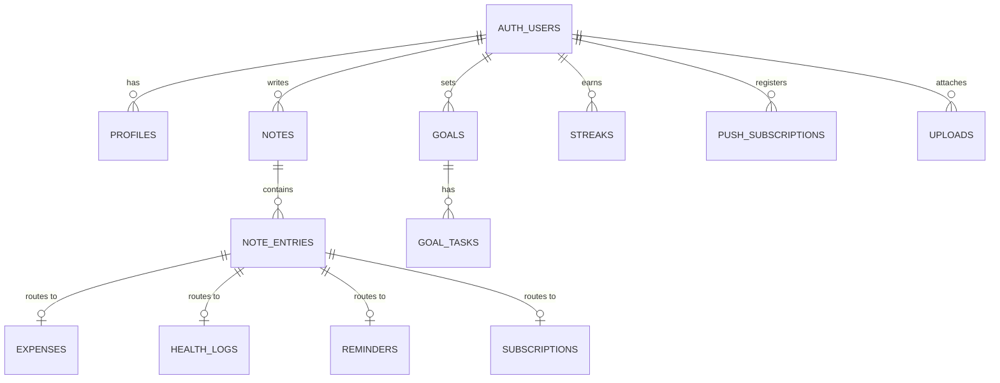
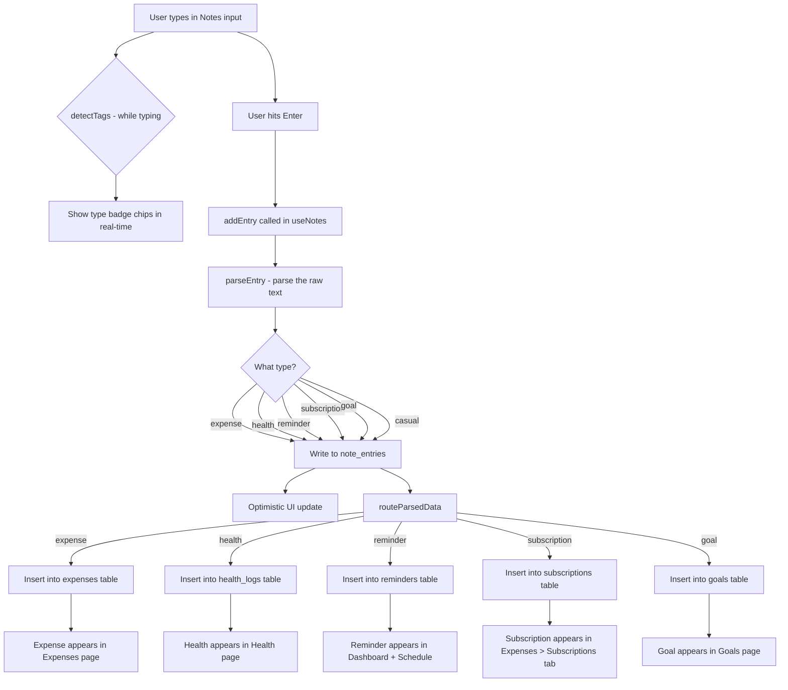
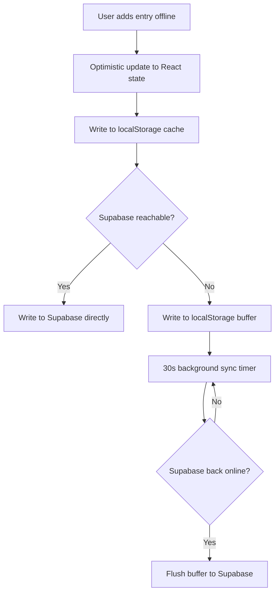
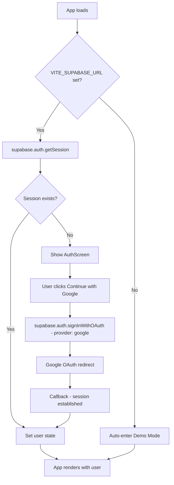

# Loco — Complete Technical Documentation
> Smart Life Journal PWA · March 2026

---

## Table of Contents

1. [What is Loco?](#1-what-is-loco)
2. [Tech Stack](#2-tech-stack)
3. [Project Structure](#3-project-structure)
4. [Design System](#4-design-system)
5. [Database Schema](#5-database-schema)
6. [The @ Command System](#6-the--command-system)
7. [Data Flow — End to End](#7-data-flow--end-to-end)
8. [Auth Flow](#8-auth-flow)
9. [Hooks Reference](#9-hooks-reference)
10. [Pages Reference](#10-pages-reference)
11. [Navigation Architecture](#11-navigation-architecture)
12. [Offline-First Strategy](#12-offline-first-strategy)
13. [AI Integration](#13-ai-integration)
14. [Push Notifications](#14-push-notifications)
15. [PWA Setup](#15-pwa-setup)
16. [Environment Variables](#16-environment-variables)
17. [Deployment](#17-deployment)
18. [Schema SQL — Supabase Setup](#18-schema-sql--supabase-setup)

---

## 1. What is Loco?

Loco is a **smart life journal** — not a notes app. The user writes casually throughout the day using `@` commands, and the app automatically parses, categorises, and stores structured data into the right sections.

**Core philosophy:** Write once → tracked everywhere. Zero friction.

**Example session:**
```
petrol 159 @e         → expenses table: ₹159, transport
gym 45min @h          → health_logs: workout, 45 min
call mum @R 9pm       → reminders: "call mum" at 21:00 today
netflix 649 @sub      → subscriptions: Netflix ₹649 monthly
feeling good @casual  → casual journal entry, no parsing
```

Everything flows through a single input box in the Notes tab.

---

## 2. Tech Stack

| Layer | Technology | Why |
|---|---|---|
| Frontend | React 19 + Vite 8 | Latest React, fast HMR |
| Styling | Tailwind CSS v3 | Utility-first, design tokens |
| Auth | Supabase Auth (Google OAuth) | Free tier, easy setup |
| Database | Supabase Postgres | Free tier, RLS built-in |
| AI | Groq API (llama-3.3-70b-versatile) | Free, fast inference |
| PDFs | jsPDF + jspdf-autotable | Export reports |
| Excel | SheetJS (xlsx) | Export spreadsheets |
| Icons | Lucide React | Consistent icon set |
| Router | React Router DOM v7 | SPA routing |
| Deploy | Vercel | Free tier, instant deploys |
| PWA | manifest.json + sw.js | Installable, offline |

**All on free tier. No paid APIs.**

---

## 3. Project Structure

```
Progress Tracker/
├── public/
│   ├── manifest.json          ← PWA manifest
│   ├── sw.js                  ← Service worker
│   ├── favicon.svg
│   └── icons/
│       ├── icon-192.png
│       └── icon-512.png
├── src/
│   ├── components/
│   │   ├── ui/
│   │   │   ├── Button.jsx     ← btn-primary / btn-ghost variants
│   │   │   ├── Card.jsx       ← surface card wrapper
│   │   │   ├── SearchBar.jsx  ← search input with clear
│   │   │   └── Sheet.jsx      ← bottom sheet modal
│   │   ├── AuthScreen.jsx     ← Google sign-in page
│   │   └── Layout.jsx         ← TopBar + BottomNav + More menu
│   ├── hooks/
│   │   ├── useAuth.js         ← Supabase auth state
│   │   ├── useDarkMode.js     ← localStorage dark mode toggle
│   │   ├── useNotes.js        ← Rolling journal (CORE)
│   │   ├── useExpenses.js     ← Supabase expense CRUD
│   │   ├── useSubscriptions.js← Subscription management
│   │   ├── useHealth.js       ← Health log CRUD + streaks
│   │   ├── useGoals.js        ← Goal tracking with Supabase
│   │   ├── useReminders.js    ← localStorage reminders + browser notifs
│   │   └── useWeeklyGoals.js  ← (legacy) weekly table tool
│   ├── lib/
│   │   ├── supabase.js        ← Supabase client setup
│   │   ├── groq.js            ← Groq AI chat + prompts
│   │   └── parseEntry.js      ← @ COMMAND PARSER (THE CORE)
│   ├── pages/
│   │   ├── Dashboard.jsx      ← Daily snapshot
│   │   ├── Notes.jsx          ← Rolling journal UI
│   │   ├── Goals.jsx          ← Goal checklist
│   │   ├── Expenses.jsx       ← Expense table + subscriptions
│   │   ├── Health.jsx         ← Health logs + streaks
│   │   ├── AI.jsx             ← Groq chat interface
│   │   └── Settings.jsx       ← App configuration
│   ├── App.jsx                ← Root router
│   ├── index.css              ← Tailwind + design tokens
│   └── main.jsx               ← React root
├── index.html                 ← PWA HTML shell
├── tailwind.config.js         ← Design system tokens
├── vite.config.js             ← Build config
├── supabase_schema.sql        ← Full DB schema
└── .env.local                 ← VITE_SUPABASE_URL, VITE_SUPABASE_ANON_KEY
```

---

## 4. Design System

Defined in [tailwind.config.js](file:///o:/Personal%20POV/Progress%20Tracker/tailwind.config.js) and [src/index.css](file:///o:/Personal%20POV/Progress%20Tracker/src/index.css).

### Color Tokens

| Token | Dark | Light | Use |
|---|---|---|---|
| `bg-bg-dark` | `#000000` | `#F5F5F5` | Page background |
| `bg-surface-dark` | `#0D0D0D` | `#FFFFFF` | Cards, panels |
| `border-border-dark` | `#1A1A1A` | `#E5E5E5` | Subtle borders |
| `text-text-dark` | `#FFFFFF` | `#0A0A0A` | Primary text |
| `text-muted-dark` | `#666666` | `#737373` | Secondary text |
| `primary` | `#FF3B3B` | `#FF3B3B` | Accent, CTAs |

### Typography
- **Headings:** `font-serif` → Lora (Google Fonts)
- **Body:** `font-sans` → Nunito (Google Fonts)

### Reusable CSS Classes ([index.css](file:///o:/Personal%20POV/Progress%20Tracker/src/index.css))

| Class | Purpose |
|---|---|
| `.card` | Surface card with border + shadow |
| `.btn-primary` | Red filled button |
| `.btn-ghost` | Bordered ghost button |
| `.btn-icon` | Square icon-only button |
| `.input` | Text input field |
| `.textarea` | Multi-line text area |
| `.tag` | Pill badge |
| `.progress-track` | Progress bar container |
| `.progress-fill` | Progress bar fill (primary color) |

---

## 5. Database Schema

12 tables, all with Row Level Security enabled. Every query is automatically scoped to the authenticated user via `auth.uid()` — no manual user_id filters needed.



### Table Summary

| Table | Key Columns | Purpose |
|---|---|---|
| `profiles` | id, currency, timezone, monthly_budget | User settings |
| `notes` | user_id, note_date (unique constraint) | One per day |
| `note_entries` | note_id, raw_text, parsed_type, parsed_data, entry_time | Individual log lines |
| `expenses` | description, amount, category, date | From `@e` |
| `subscriptions` | name, amount, cycle, next_due, remind_days_before | From `@sub` |
| `health_logs` | metric, value, unit, note, date | From `@h` |
| `goals` | title, progress, target, unit, due, status | From `@g` |
| `goal_tasks` | goal_id, title, done, sort_order | Sub-tasks |
| `reminders` | title, remind_at, push_sent | From `@R` |
| `push_subscriptions` | endpoint, p256dh, auth_key | Browser push |
| `uploads` | filename, storage_path, mime_type | From `@upload` |
| `streaks` | category, current_streak, longest_streak | Tracking |

### Unique Constraint — Rolling Journal
```sql
unique(user_id, note_date)  -- on notes table
```
This ensures there is **exactly one note per user per day**. Entries are upserted:
```js
await supabase.from('notes').upsert(
  { user_id, note_date: today },
  { onConflict: 'user_id,note_date' }
)
```

---

## 6. The @ Command System

**File: [src/lib/parseEntry.js](file:///o:/Personal%20POV/Progress%20Tracker/src/lib/parseEntry.js)** — This is the heart of the app. Every journal line goes through this parser.

### Tag Routing Table

| Input Tag | Aliases | Parsed Type | Routes To |
|---|---|---|---|
| `@e` | `@expense`, `@exp` | `expense` | `expenses` table |
| `@R` | `@remind`, `@reminder` | `reminder` | `reminders` table |
| `@h` | `@health` | `health` | `health_logs` table |
| `@casual` | `@c`, `@journal` | `casual` | stored in note_entry only |
| `@upload` | `@file`, `@attach` | `upload` | `uploads` table |
| `@sub` | `@subscription` | `subscription` | `subscriptions` table |
| `@g` | `@goal` | `goal` | `goals` table |
| _(none)_ | — | `casual` | stored in note_entry only |

### Parser: [parseEntry(text)](file:///o:/Personal%20POV/Progress%20Tracker/src/lib/parseEntry.js#253-408)

```
Input: "petrol 159 @e"

Steps:
1. Scan for @tags (longest match first to avoid @e matching in @expense)
2. Detect type → "expense"
3. Remove tag from text → "petrol 159"
4. Extract amount → 159 (via regex patterns)
5. Detect category → "transport" (keyword match against EXPENSE_CATEGORIES)
6. Clean description → "Petrol"

Output: {
  type: "expense",
  raw: "petrol 159 @e",
  data: { description: "Petrol", amount: 159, category: "transport", date: "2026-03-21" }
}
```

### Expense Category Detection

Keywords map to categories:
```js
transport: ['petrol', 'diesel', 'uber', 'cab', 'bus', 'train', 'metro', ...]
food:      ['coffee', 'lunch', 'dinner', 'zomato', 'swiggy', 'biryani', ...]
shopping:  ['amazon', 'flipkart', 'clothes', 'shoes', ...]
health:    ['doctor', 'medicine', 'gym', 'pharmacy', ...]
bills:     ['electricity', 'wifi', 'rent', 'emi', 'insurance', ...]
...
```

### Reminder Time Parsing

```
"call mum @R 9pm tonight"     → today 21:00
"dentist @R tomorrow 10am"    → tomorrow 10:00
"meeting @R monday 3pm"       → next Monday 15:00
"gym @R in 2 hours"           → now + 2hrs
"standup @R morning"          → tomorrow 08:00 (if passed)
"meeting @R"                  → tomorrow 08:00 (fallback)
```

Rules:
- If time already passed today → push to tomorrow same time
- No time specified → fallback: next morning 08:00

### Health Value Extraction

```
"gym 45min @h"      → { value: 45, unit: "min", metric: "workout" }
"weight 72.5kg @h"  → { value: 72.5, unit: "kg", metric: "weight" }
"slept 7hrs @h"     → { value: 7, unit: "hr", metric: "sleep" }
"8 glasses @h"      → { value: 8, unit: "glasses", metric: "water" }
"10000 steps @h"    → { value: 10000, unit: "steps", metric: "steps" }
```

---

## 7. Data Flow — End to End



### Offline Path



---

## 8. Auth Flow

**File: [src/hooks/useAuth.js](file:///o:/Personal%20POV/Progress%20Tracker/src/hooks/useAuth.js)**



**Demo Mode:** When Supabase credentials are missing, the app auto-enters demo mode with seeded fake data. Perfect for development without a Supabase project.

---

## 9. Hooks Reference

### [useAuth.js](file:///o:/Personal%20POV/Progress%20Tracker/src/hooks/useAuth.js)
```js
const { user, session, loading, isDemoMode, signInWithGoogle, signOut, enterDemoMode } = useAuth()
```
- Wraps `supabase.auth.getSession()` + `onAuthStateChange` listener
- Detects missing Supabase config → auto demo mode
- Passes `provider_token` for Google Drive access (future use)

### [useDarkMode.js](file:///o:/Personal%20POV/Progress%20Tracker/src/hooks/useDarkMode.js)
```js
const { isDark, toggle } = useDarkMode()
```
- Persists to `localStorage` key `loco_dark_mode`
- Adds/removes `dark` class on `<html>` element
- Defaults to dark mode

### [useNotes.js](file:///o:/Personal%20POV/Progress%20Tracker/src/hooks/useNotes.js) ⭐ (Core)
```js
const { entries, groupedEntries, loading, addEntry, editEntry, deleteEntry } = useNotes({ userId, isDemoMode })
```
- `entries`: flat array of all note_entries
- `groupedEntries`: `[{ date, entries[] }]` sorted newest-first
- `addEntry(rawText)`: parses via [parseEntry()](file:///o:/Personal%20POV/Progress%20Tracker/src/lib/parseEntry.js#253-408), upserts daily note, inserts entry, routes to related tables
- `editEntry(id, newRawText)`: re-parses and updates, marks `is_edited: true`
- Offline buffer: failed writes go to `loco_notes_buffer`, retried every 30s

### [useExpenses.js](file:///o:/Personal%20POV/Progress%20Tracker/src/hooks/useExpenses.js)
```js
const { expenses, addExpense, deleteExpense, getMonthTotal, getWeekTotal, getCategoryBreakdown } = useExpenses({ userId, isDemoMode })
```
- All Supabase CRUD with localStorage cache fallback
- `getCategoryBreakdown()` returns `[{ category, total }]` sorted by total (for current month)

### [useSubscriptions.js](file:///o:/Personal%20POV/Progress%20Tracker/src/hooks/useSubscriptions.js)
```js
const { subscriptions, addSubscription, deleteSubscription, getMonthlyTotal, getDaysUntilRenewal } = useSubscriptions({ userId, isDemoMode })
```
- `getMonthlyTotal()` converts all cycles to monthly equivalent:
  - weekly × 4.33
  - monthly × 1
  - quarterly ÷ 3
  - yearly ÷ 12

### [useHealth.js](file:///o:/Personal%20POV/Progress%20Tracker/src/hooks/useHealth.js)
```js
const { logs, groupedLogs, addLog, deleteLog, getStreak, getWeeklyTrend } = useHealth({ userId, isDemoMode })
```
- `getStreak(metric)`: counts consecutive days with at least one log for that metric
- `getWeeklyTrend(metric)`: returns last 7 days `[{ date, label, value }]` for chart rendering

### [useGoals.js](file:///o:/Personal%20POV/Progress%20Tracker/src/hooks/useGoals.js)
```js
const { goals, addGoal, updateGoalProgress, updateGoalStatus, deleteGoal } = useGoals({ userId, isDemoMode })
```
- Progress updates auto-set `status: 'done'` when `progress >= target`
- Supabase + localStorage cache with demo data fallback

### [useReminders.js](file:///o:/Personal%20POV/Progress%20Tracker/src/hooks/useReminders.js)
```js
const { reminders, addReminder, toggleDone, deleteReminder } = useReminders()
```
- localStorage only (for now — Supabase reminders from `@R` are separate)
- Schedules browser `Notification` at 15min, 10min before, and at exact time
- Fires AudioContext beep alongside notification

---

## 10. Pages Reference

### Dashboard (`/dashboard`)
**Daily snapshot — no data entry here.**

Sections:
- Personalized greeting (Good morning/afternoon/evening + first name)
- Budget warning banner if expenses ≥ 80% of monthly budget
- 4 stat cards: Monthly Expenses (₹), Subscriptions count, Active Goals, Max Streak
- Today's Reminders (with checkbox toggle)
- Goals Progress (top 5 active, mini progress bars)
- Health Streaks (workout/water/sleep/steps Duolingo-style)
- AI Daily Summary (click to generate via Groq)

### Notes (`/notes`) — Rolling Journal
**The main input interface.**

- Single text input always visible at top — type and hit Enter
- Live tag detection as you type → shows badge chips before submitting
- Entries grouped by day, newest first (diary style)
- Each entry shows: timestamp | raw text | type badge | parsed data preview
- Inline editing (click edit → modify → Enter to save / Esc to cancel)
- Collapsible day blocks
- Search button to filter across all entries
- Help button shows all @ commands

### Goals (`/goals`)
- Progress bar cards with target/unit system
- Stats: total, completed, avg % 
- Status filter: all / active / done / paused
- Per-goal: AI Next Steps button (Groq), pause/resume, delete
- Add Goal sheet with title, target, unit, due date

### Expenses (`/expenses`)
**Two tabs: Expenses | Subscriptions**

**Expenses tab:**
- Summary cards: this week, this month, subscriptions/mo
- Category breakdown bar chart (current month)
- Day/Week/Month/All filter
- Data table: Date | Description | Amount (₹) | Category
- Export: PDF (jsPDF autotable) or Excel (SheetJS)

**Subscriptions tab:**
- Table: Name | Amount | Cycle | Next Due | Days Left
- Days Left shown in red if ≤ `remind_days_before`
- Monthly equivalent total in footer

### Health (`/health`)
- 4 streak cards: workout, water, sleep, steps
- Weekly trend chart (mini bar chart, 7 days, switchable metric)
- Daily grouped logs with metric icon + value + note
- Add Log sheet: metric selector, value, unit, note

### AI (`/ai`)
- Multi-turn chat with Groq llama-3.3-70b-versatile
- Requires Groq API key (stored in localStorage as `loco_groq_key`)
- System prompt includes last 20 notes + all goals for context
- Quick action chips when chat is empty
- Change key button in header

### Settings (`/settings`)
- Profile picture + name display
- Groq API key (paste-and-save, show/hide toggle)
- Monthly Budget (₹ input → triggers 80% warning)
- Fuzzy AI Detection toggle (off by default)
- Renewal reminder days (default: 3)
- About section

---

## 11. Navigation Architecture

```
BottomNav (fixed, pill-style active state)
├── Dashboard  (/dashboard)
├── Notes      (/notes)
├── Goals      (/goals)
└── ⋯ More menu (popup)
    ├── Expenses  (/expenses)
    ├── Health    (/health)
    ├── AI        (/ai)
    └── Settings  (/settings)

TopBar (sticky)
├── Loco logo (left)
├── Dark mode toggle
├── Sign out button
└── Avatar (right)
```

The [Layout](file:///o:/Personal%20POV/Progress%20Tracker/src/components/Layout.jsx#146-161) component wraps all pages and provides the TopBar + BottomNav shell. Pages render inside `<main>`.

---

## 12. Offline-First Strategy

### localStorage Keys

| Key | Contents | Hook |
|---|---|---|
| `loco_entries_cache` | All note_entries array | useNotes |
| `loco_notes_buffer` | Pending offline writes | useNotes |
| `loco_expenses_cache` | All expenses array | useExpenses |
| `loco_subscriptions_cache` | All subscriptions | useSubscriptions |
| `loco_health_cache` | All health logs | useHealth |
| `loco_goals_cache` | All goals | useGoals |
| `loco_reminders` | Reminders (localStorage-primary) | useReminders |
| `loco_weekly_goals` | Legacy weekly goals table | useWeeklyGoals |
| `loco_dark_mode` | `"true"` or `"false"` | useDarkMode |
| `loco_groq_key` | Groq API key string | AI page, Settings |
| `loco_monthly_budget` | Budget amount as string | Settings, Dashboard |
| `loco_fuzzy_ai` | `"true"` or `"false"` | Settings |
| `loco_remind_days` | Days before subscription alert | Settings |

### Write Strategy
1. **Optimistic update** — state updated immediately, UI responds instantly
2. **Cache write** — `localStorage` updated in sync with state
3. **Supabase write** — async, background
4. **On failure** — entry goes to `loco_notes_buffer`
5. **Sync** — every 30 seconds, buffer is flushed to Supabase

---

## 13. AI Integration

**File: [src/lib/groq.js](file:///o:/Personal%20POV/Progress%20Tracker/src/lib/groq.js)**

### [chat({ apiKey, systemPrompt, messages })](file:///o:/Personal%20POV/Progress%20Tracker/src/lib/groq.js#5-39)
Core Groq API call. Posts to `https://api.groq.com/openai/v1/chat/completions` with `llama-3.3-70b-versatile`.

### [buildSystemPrompt({ user, notes, goals })](file:///o:/Personal%20POV/Progress%20Tracker/src/lib/groq.js#70-103)
Builds a rich context string injected as the system message:
```
You are Loco AI — personal productivity assistant.
User: Saran

USER NOTES:
- [casual] feeling good: feeling good
- [expense] petrol: petrol 159

USER GOALS:
- Run 5K (3.2/5 km, active, due: 2026-04-01)

Keep responses helpful, concise, and friendly.
```

### [summariseNote({ apiKey, note })](file:///o:/Personal%20POV/Progress%20Tracker/src/lib/groq.js#40-54)
One-shot note summarisation using a focused system prompt.

### [suggestGoalSteps({ apiKey, goal })](file:///o:/Personal%20POV/Progress%20Tracker/src/lib/groq.js#55-69)
Returns 3–5 numbered actionable steps for a goal.

### Groq Key Storage
- User pastes key in **Settings** or **AI** page
- Saved to `localStorage` as `loco_groq_key`
- Never sent to Loco servers
- Loaded on each API call

---

## 14. Push Notifications

**File: [src/hooks/useReminders.js](file:///o:/Personal%20POV/Progress%20Tracker/src/hooks/useReminders.js)**

Uses the browser `Notification` API (not Web Push — no server needed):

```js
// Request permission
await Notification.requestPermission()

// Fire notification
new Notification("⏰ 15 min reminder — call mum", {
  body: "Your reminder is coming up",
  icon: '/icons/icon-192.png'
})

// AudioContext beep
const ctx = new AudioContext()
const osc = ctx.createOscillator()
// ... 880 Hz beep for 0.4s
```

### Notification Schedule (per reminder)
| Trigger | When |
|---|---|
| 15-minute warning | `remind_at - 15 min` |
| 10-minute warning | `remind_at - 10 min` |
| Exact time | `remind_at` |

All `setTimeout` timers are stored in a `ref` array and cleared on unmount.

---

## 15. PWA Setup

**[public/manifest.json](file:///o:/Personal%20POV/Progress%20Tracker/public/manifest.json)**
```json
{
  "name": "Loco",
  "short_name": "Loco",
  "theme_color": "#FF3B3B",
  "background_color": "#000000",
  "display": "standalone",
  "start_url": "/",
  "icons": [...]
}
```

**[public/sw.js](file:///o:/Personal%20POV/Progress%20Tracker/public/sw.js)** — Service worker for caching:
- Caches app shell on install
- Serves from cache on fetch (network-first strategy)
- Enables offline app loading

**Registration (index.html):**
```html
<script>
  if ('serviceWorker' in navigator) {
    window.addEventListener('load', () => {
      navigator.serviceWorker.register('/sw.js')
    })
  }
</script>
```

---

## 16. Environment Variables

**[.env.local](file:///o:/Personal%20POV/Progress%20Tracker/.env.local) (never commit this file):**
```env
VITE_SUPABASE_URL=https://xxxx.supabase.co
VITE_SUPABASE_ANON_KEY=eyJhbGc...
```

**Groq API key** is user-provided in the UI — not an env variable.

**Demo Mode trigger:** If `VITE_SUPABASE_URL` is missing or equals `your_supabase_project_url`, the app auto-enters demo mode with seeded data — no Supabase connection attempted.

---

## 17. Deployment

### Vercel (Recommended)
```bash
# 1. Install Vercel CLI
npm i -g vercel

# 2. Deploy
vercel

# 3. Set environment variables in Vercel dashboard:
#    VITE_SUPABASE_URL
#    VITE_SUPABASE_ANON_KEY
```

### Local Development
```bash
npm install
npm run dev
# → http://localhost:5173
```

### Supabase Setup
1. Go to [supabase.com](https://supabase.com) → New Project
2. SQL Editor → paste contents of [supabase_schema.sql](file:///o:/Personal%20POV/Progress%20Tracker/supabase_schema.sql) → Run
3. Authentication → Providers → Google → Enable, add Client ID + Secret
4. Authentication → URL Configuration → add your Vercel URL to Allowed Redirect URLs
5. Copy Project URL and Anon Key into [.env.local](file:///o:/Personal%20POV/Progress%20Tracker/.env.local)

---

## 18. Schema SQL — Supabase Setup

Run the **entire** [supabase_schema.sql](file:///o:/Personal%20POV/Progress%20Tracker/supabase_schema.sql) in one go in the Supabase SQL editor. It creates:

- ✅ 12 tables with RLS
- ✅ All RLS policies (user owns their own data)
- ✅ 3 views (monthly/weekly expense summary, subscription monthly cost)
- ✅ Auto `updated_at` trigger
- ✅ Auto profile creation on signup trigger

### Key Design Decisions

**1. `unique(user_id, note_date)` on `notes`**
Forces one note per day. Using Supabase upsert with conflict resolution:
```sql
INSERT INTO notes (user_id, note_date)
VALUES (auth.uid(), current_date)
ON CONFLICT (user_id, note_date) DO NOTHING;
```

**2. `parsed_data jsonb` on `note_entries`**
Stores the full parsed payload as JSON so even if the destination table write fails, the raw parsed data is preserved and can be re-routed later.

**3. `note_entry_id` foreign keys on child tables**
Every expense/health/reminder/subscription optionally links back to the `note_entry` that created it — enabling future "show source" features.

**4. RLS everywhere, no user_id filters in code**
Because RLS is enabled and policies filter `auth.uid() = user_id` on every table, the React code never needs to pass `user_id` in WHERE clauses. Supabase handles this transparently.

---

## Appendix: Full @ Command Examples

```
# Expenses
petrol 159 @e                    → transport, ₹159
coffee 80 @expense               → food, ₹80
lunch ₹250 @e                    → food, ₹250
groceries 820 @e                 → food, ₹820
doctor 500 @exp                  → health, ₹500

# Health
gym 45min @h                     → workout, 45 min
run 5km @h                       → workout, 5 km
weight 72.5kg @h                 → weight, 72.5 kg
slept 7.5hrs @health             → sleep, 7.5 hr
8 glasses water @h               → water, 8 glasses
mood 8/10 @h                     → mood, 8

# Reminders
call mum @R 9pm                  → today 21:00
dentist @R tomorrow 10am         → tomorrow 10:00
standup @R monday 9am            → next Monday 09:00
submit report @R in 2 hours      → now + 2 hrs
review notes @R morning          → tomorrow 08:00

# Subscriptions
netflix 649 @sub monthly         → Netflix ₹649/mo
spotify 119 @sub                 → Spotify ₹119/mo
icloud 75 @subscription yearly   → iCloud ₹75/yr
youtube premium 149 @sub         → ₹149/mo

# Goals
learn guitar @g                  → new goal
run 5k @goal                     → new goal

# Casual
just chilling @casual            → journal entry only
had a great day @c               → journal entry only

# No tag
just writing stuff               → casual (no routing)
```

---

*Documentation generated: 21 March 2026 · Loco v1.0.0*
